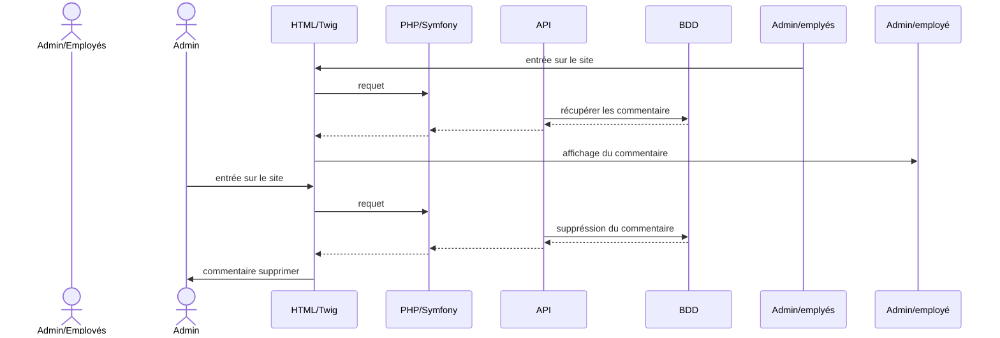

# sequence commentaires

## sequence d' un commentaire

```mermaid
sequenceDiagram
    actor Admin/Employés
    actor Admin
    participant HTML/Twig
    participant PHP/Symfony
    participant API
    participant BDD

Admin/emplyés ->> HTML/Twig: entrée sur le site
HTML/Twig ->> PHP/Symfony: requet
API ->> BDD: récupérer les commentaire
BDD -->> API: 
API -->> PHP/Symfony: 
PHP/Symfony -->>HTML/Twig:
HTML/Twig ->> Admin/employé: affichage du commentaire

Admin ->> HTML/Twig: entrée sur le site
HTML/Twig ->> PHP/Symfony: requet
API ->> BDD: suppréssion du commentaire
BDD -->> API: 
API -->> PHP/Symfony: 
PHP/Symfony -->>HTML/Twig:
HTML/Twig ->> Admin: commentaire supprimer
```
